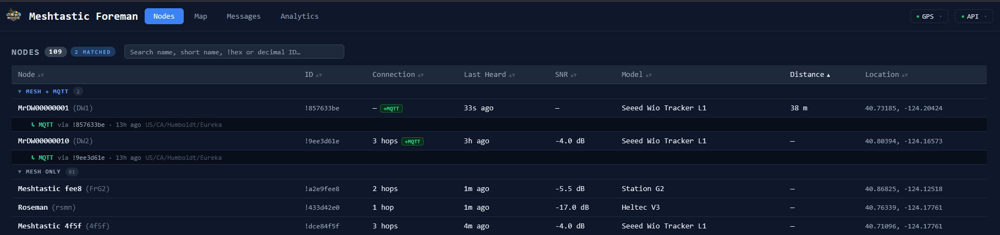
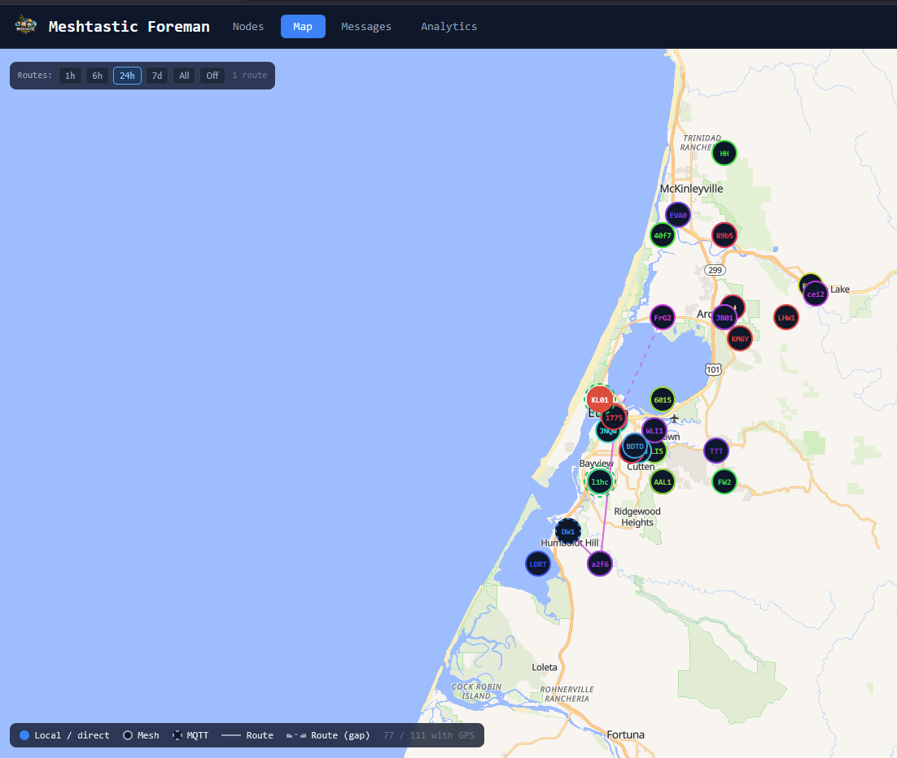
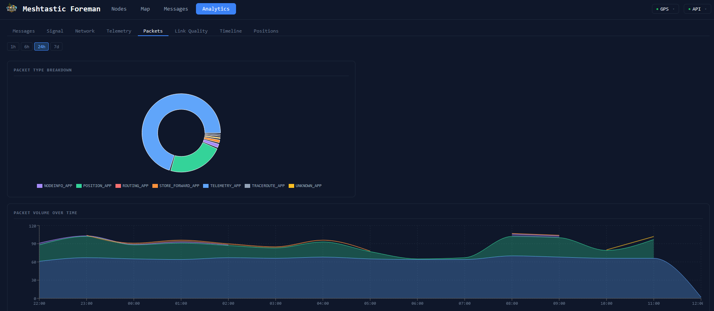

# MeshtasticForeman

**A self-hosted dashboard and API for Meshtastic mesh networks.**  
Connect a device via USB, and get a live map, node list, analytics, and messaging — all from your browser.

---

| Nodes | Map | Analytics |
|-------|-----|-----------|
|  |  |  |

---

## What it is

MeshtasticForeman is a Node.js daemon that maintains a persistent serial connection to a Meshtastic device, stores everything in a local PostgreSQL-compatible database, and serves a React frontend for exploring your mesh. It is a full alternative to `client.meshtastic.org` that you run yourself.

It also acts as an **MQTT gateway** — if you set a broker in `.env`, it re-encrypts and publishes mesh traffic so nRF52-based devices (no built-in WiFi) can appear on the public map.

> **Alpha software and built with AI.** Goals are clear, but it is still evolving. Built in partnership with AI — if that bothers you, this probably isn't for you.

## Quick start

```sh
cp .env.example .env        # set MESHTASTIC_PORT at minimum
pnpm install
./start-both.sh             # or start-both.ps1 on Windows
```

Then open `http://localhost:3173` in your browser.  
Pre-built installers for Windows and Linux are on the [Releases](../../releases) page.

## Go deeper

| | |
|--|--|
| [Setup & configuration](docs/SETUP.md) | Full env vars, installer options, production build |
| [Architecture](docs/ARCHITECTURE.md) | How the daemon, frontend, and MQTT gateway fit together |
| [API reference](API_PROMISES.md) | Every REST endpoint and WebSocket command with inputs and return shapes |
| [Roadmap](docs/ROADMAP.md) | What works today and what's being explored |

## Contributing

Patches, bug reports, and feature suggestions are welcome. Fork the repo, make your change on a branch, and open a pull request with a clear description. Not sure where to start? Open an issue first — no PR required to start a conversation.

## Thanks

None of this would exist without the [Meshtastic](https://meshtastic.org) team and community — they built the firmware, protocol, and client libraries this project builds on top of.
